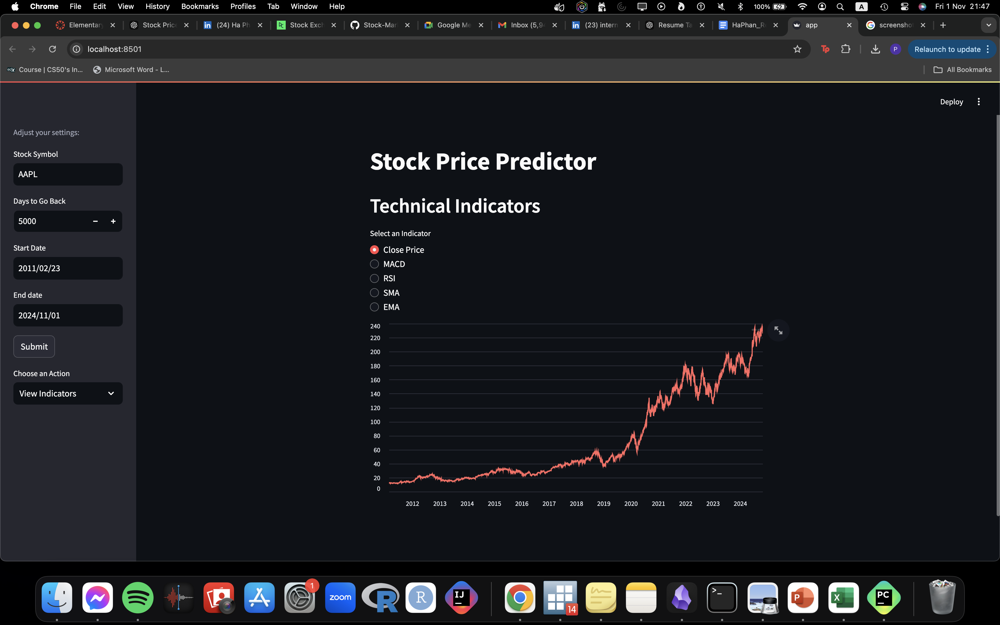

# Stock Price Predictor

Welcome to the Stock Price Predictor app! 🎉 This web application allows you to predict stock prices using historical data, powered by various machine learning models and technical indicators. Whether you’re a seasoned investor or just curious about the stock market, this app provides insights that can help you make informed decisions.



## What Can You Do?

- **Explore Technical Indicators**: Dive into stock price movements with popular indicators like MACD, RSI, SMA, and EMA. Understand market trends better!
- **View Recent Data**: Get a quick glance at the latest stock prices and trends in an easy-to-read table format.
- **Make Predictions**: Use advanced machine learning models to forecast future stock prices based on historical data. Test your predictions and see how they compare with actual outcomes!

## Technologies Behind the Scenes

This project uses a combination of powerful tools and libraries:

- **Streamlit**: The backbone of our web interface, making everything user-friendly.
- **Pandas**: For all the data manipulation and analysis magic.
- **yfinance**: To pull in historical stock data directly from Yahoo Finance.
- **Altair**: For beautiful data visualizations that make trends easy to see.
- **Technical Analysis Library (ta)**: To calculate various technical indicators.
- **Scikit-Learn**: For machine learning models and evaluation metrics.
- **XGBoost**: To implement high-performance gradient boosting algorithms.

## Getting Started

Want to run the app locally? Here’s how to get it up and running on your machine:

1. **Clone the repository**:
   ```bash
   git clone https://github.com/ha15082005/Stock-Market-Prediction.git
   cd Stock-Market-Prediction
2. **Set up a virtual environment (optional but recommended)**:
   ```bash
   python -m venv venv
   source venv/bin/activate
3. **Install the required packages**:
   ```bash
   pip install -r requirements.txt
4. **Run the application**:
   ```bash
   streamlit run app.py

## How To Use App
1. **Enter the Stock Symbol**: Type in the stock symbol you're interested in (like AAPL for Apple).
2. **Select Your Date Range**: Choose the time frame for the historical data you want to analyze.
3. **Explore the Options**: Use the sidebar to view technical indicators, check recent stock data, or make predictions with different machine learning models.

## Models Used
We’ve incorporated several powerful machine learning models for predicting stock prices:
- **Linear Regression**: A classic approach for making predictions.
- **Random Forest**: A robust ensemble method that handles non-linear data well.
- **Extra Trees**: Similar to Random Forest, but with a different approach to tree construction.
- **K-Nearest Neighbors**: A simple yet effective model for prediction based on similarity.
- **XGBoost**: A high-performance model that excels in speed and accuracy.
